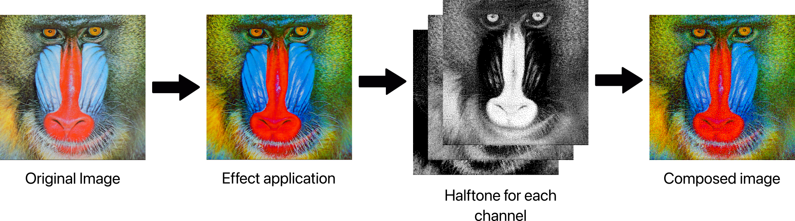

# Halftone Color: Space-Filling Curve Halftoning for RGB Images

[](https://www.python.org/)
[](https://opencv.org/)
[](LICENSE)



An implementation of color halftoning using space-filling curves, extending the original monochrome algorithm from the SIGGRAPH '91 paper.

## Table of Contents
- [About](#about)
- [Algorithm](#algorithm)
- [Effects](#algorithm)
- [Installation](#installation)
- [Usage](#usage)
- [Examples](#examples)
- [Contributors](#contributors)
- [Acknowledgments](#acknowledgments)
- [License](#license)

## About

This project implements a color version of the halftoning algorithm described in:

**"Digital halftoning with space filling curves"**  
*Luiz Velho and Jonas de Miranda Gomes*  
SIGGRAPH '91 ([DOI: 10.1145/122718.122727](https://doi.org/10.1145/122718.122727))

Developed during the 2025 summer course [Reproducing Results in Computer Graphics](https://lhf.impa.br/cursos/rr/) at IMPA, this extension adds RGB image support to the original monochrome implementation.

## Algorithm

The space-filling curve approach provides:
- Superior dot distribution compared to regular grids
- Better detail preservation
- Smother tonal transitions

Our color implementation:
1. Decomposes RGB image into channels
2. Applies space-filling curve halftoning to each channel
3. Recombines channels with color correction
4. Optional post-processing for enhanced results

## Installation

### Requirements
- Python 3.8+
- OpenCV
- NumPy

### Setup
```bash
git clone https://github.com/yourusername/halftone-color.git
cd halftone-color
pip install -r requirements.txt