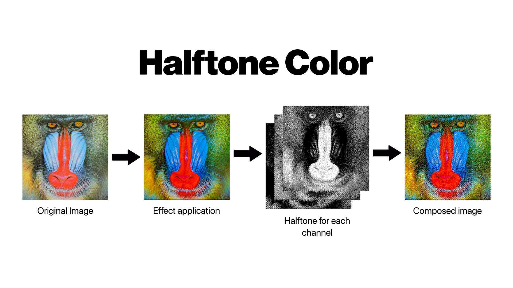
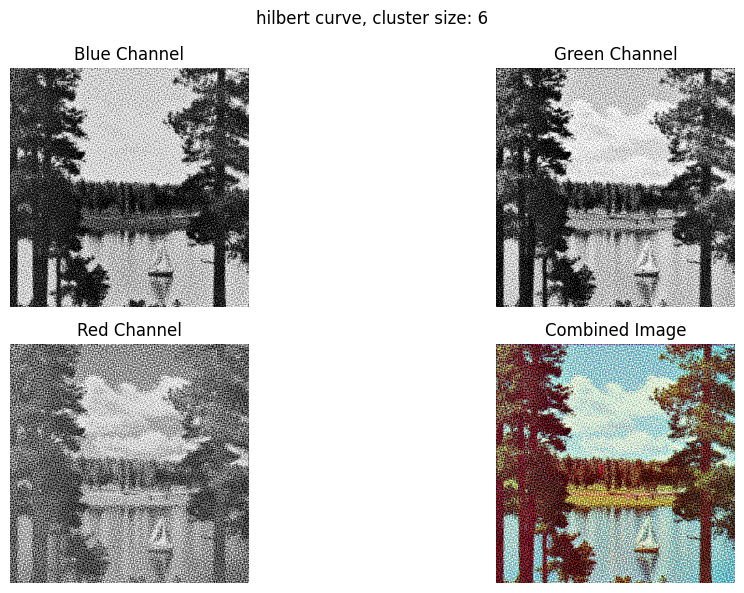
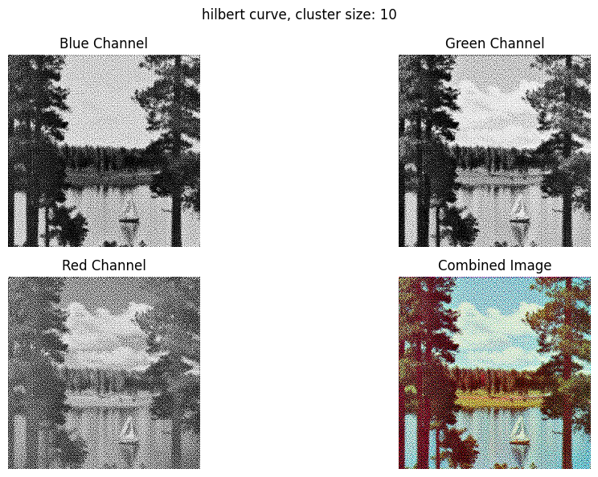

# Halftone Color: Space-Filling Curve Halftoning for RGB Images

[](https://www.python.org/)
[](https://opencv.org/)
[](LICENSE)



An implementation of color halftoning using space-filling curves, extending the original monochrome algorithm from the SIGGRAPH '91 paper.

## Table of Contents:
- [About](#about)
- [Algorithm](#algorithm)
- [Effects](#algorithm)
- [Examples](#examples)
- [Installation](#installation)
- [Acknowledgments](#acknowledgments)
- [License](#license)

## About:

This project implements a color version of the halftoning algorithm described in:

**"Digital halftoning with space filling curves"**  
*Luiz Velho and Jonas de Miranda Gomes*  
SIGGRAPH '91 ([DOI: 10.1145/122718.122727](https://doi.org/10.1145/122718.122727))

The monochrome version was reimplemented during the 2025 summer course [Reproducing Results in Computer Graphics](https://lhf.impa.br/cursos/rr/)by me, Bianca Zavadisk de Abreu, Gustavo Souza Cardoso, Igor Augusto Zwirtes, Igor Roberto Alves, João Marcelo, Lucas Barros Barcelos, Pedro Henrique Porto and Yan Hill at the Instituto de Mathematica Pura e Aplicada (IMPA). This extension was made by me and adds a RGB image support to the original monochrome implementation. The monochrome version was reimplemented. We used Python because it had compatibility with OpenCV and because it was the most known programming language by the group.

### Requirements:
- Python 3.8+
- OpenCV
- NumPy

## Algorithm:

The halftone works with 3 core components: Hilbert Curve Generation, Curve Generation and the Halftoning Engine

#### 1. Space Filling Curve Generation (`hilbert()/peano()/lebesgue()`)

Maps a 1D index to 2D coordinates on the specified space filling curve(SFC), this is used to transverse the pixels of the image and to conceive the halftoning.

#### 2. Curve Generation (`generate_space_filling_curve()`)

Calculates minimum curve order to cover image dimensions, and then generates complete curve coordinates
The space-filling curve approach provides:
- Superior dot distribution compared to regular grids
- Better detail preservation
- Smother tonal transitions

#### 3. Halftoning Engine (`halftoning()`)

Each color is treated as a B&W halftone in this step, just to be reunited again at the end. 

The color halftone implementation:
1. Decomposes the RGB image into three separated channels, one for each color.
2. Applies the space-filling curve halftoning to each channel
3. Then, recombines channels with color correction
4. Uses optional pre-processing for enhanced results

In this step, we have a threshold value and an intensity accumulator, when tranversing the pixels on each cluster size, we decide which pixels are going to be black and white following the SFC order and intensity accumulator. At the end of each cluster, the remaining error is sent to the next cluster in compensation.

## Effects:

#### Brightness/Contrast Adjustment (`brightnesscontrast()`)

Adjusts image brightness using a linear transformation formula:

$g(x) = \alpha \dot f(x) + \beta$

Where $\alpha > 0$, $\beta$ is the gain (contrast) and bias (brightness) parameters.

#### Saturation Adjustment (`saturation()`)

Image gets converted to HSV color space to adjust the saturation.

## Examples:

### 1. 






## Installation

#### Clone the repository

```bash
git clone https://github.com/yourusername/halftone-color.git
scd halftone-color
```

## References

This implementation follows OpenCV's basic linear transformation approach. For official documentation:

[OpenCV Basic Linear Transform Tutorial](https://docs.opencv.org/4.x/d3/dc1/tutorial_basic_linear_transform.html)  
*OpenCV 4.13.0 Documentation*

This project uses sample images from the [USC-SIPI Image Database](https://sipi.usc.edu/database/database.php?volume=misc)  
*University of Southern California, Signal and Image Processing Institute*